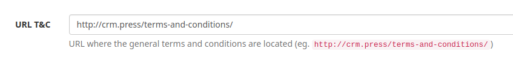
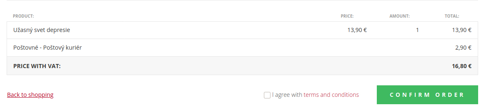
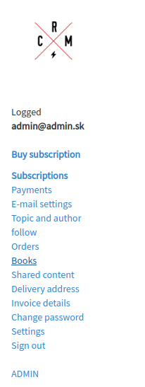
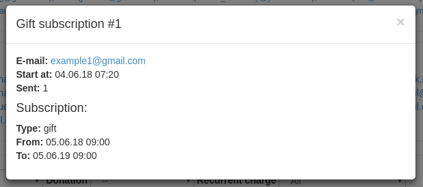
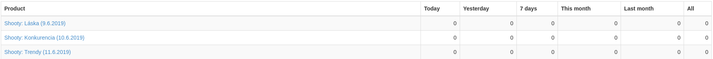

# CRM Products Module

## Configuration

### Payment gateways

To configure which gateways are available on the checkout page, you need to register the gateway and add it's label in your `config.neon` file.

Please add following snippet with the (available) gateways you want to use:

```neon
services:
	# ...
	checkoutFormFactory:
		setup:
			- addPaymentGateway(paypal, "Paypal")
			- addPaymentGateway(cardpay, "Credit card")
```

### Terms and Conditions URL

If you want the customer to agree to the terms and conditions, you need to configure URL in settings _(category **Shop**)_.



Checkbox with the link to the terms and conditions will be displayed _(and required)_ at the checkout before the customer confirms the order.



### E-books

Product module can handle orders of ebooks and provides download links in the user's section.

To display the download links of e-books you have to register your own implementation of `EbookProviderInterface` in configuration:

```
ebookProvider:
    setup:
        - register(Crm\DibukModule\Models\DibukEbookProvider())
```

And register link on library into user's section menu:

```
public function registerFrontendMenuItems(MenuContainerInterface $menuContainer)
{
    ...
    
    $menuItem = new MenuItem($this->translator->translate('products.menu.books'), ':Products:Orders:Library', '', 155);
    $menuContainer->attachMenuItem($menuItem);
}
```



## Components

**DonatedSubscriptionListingWidget**

Simple badge showing subscription donor e-mail.


[Source code](https://github.com/remp2020/crm-products-module/blob/c8d80062b7f3cb355489327e17b0b40a69d89562/src/components/DonatedSubscriptionListingWidget/DonatedSubscriptionListingWidget.php#L1)

[How to use](https://github.com/remp2020/crm-products-module/blob/c8d80062b7f3cb355489327e17b0b40a69d89562/src/ProductsModule.php#L234)

**GiftCoupons**

Dropdown listing of gift subscriptions with modal detail.




[Source code](https://github.com/remp2020/crm-products-module/blob/c8d80062b7f3cb355489327e17b0b40a69d89562/src/components/GiftCoupons/GiftCoupons.php#L1)

[How to use](https://github.com/remp2020/crm-products-module/blob/c8d80062b7f3cb355489327e17b0b40a69d89562/src/ProductsModule.php#L229)

**ProductItemsListWidget**

Payments listing single payment item widget.


[Source code](https://github.com/remp2020/crm-products-module/blob/c8d80062b7f3cb355489327e17b0b40a69d89562/src/components/PaymentItemsListWidget/ProductItemsListWidget.php#L1)

[How to use](https://github.com/remp2020/crm-products-module/blob/c8d80062b7f3cb355489327e17b0b40a69d89562/src/ProductsModule.php#L225)

**ProductStats**

Products stats listing component.



[Source code](https://github.com/remp2020/crm-products-module/blob/c8d80062b7f3cb355489327e17b0b40a69d89562/src/components/ProductsStats/ProductStats.php#L1)

[How to use](https://github.com/remp2020/crm-products-module/blob/c8d80062b7f3cb355489327e17b0b40a69d89562/src/presenters/DashboardPresenter.php#L69)
